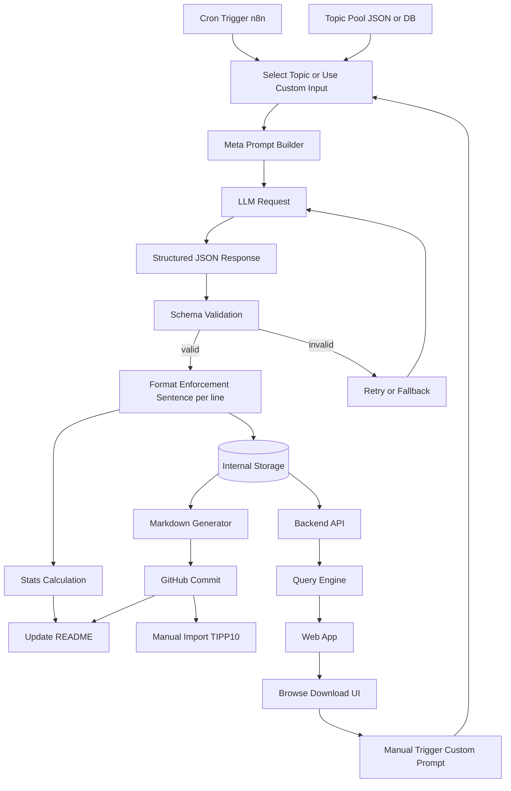

## Training Text Generator

A structured content generation system that creates high-quality typing exercises from historical and technical topics. The project is designed to automate the creation of training texts for typing practice, with a current focus on compatibility with TIPP10.

---

## Overview



The "Training Text Generator" is a backend-driven workflow that:

- Generates fact-based, engaging texts using Large Language Models (LLMs)
- Formats content specifically for typing practice (one sentence per line)
- Produces structured metadata (title, description, language, statistics)
- Stores and publishes content automatically to this repository

The system is built with scalability in mind and can later be extended into a full web application for browsing, filtering, and downloading training material.

---

## Key Features

- **Automated Content Generation**
  Daily or manual generation of new typing exercises based on predefined topics

- **Structured Output**
  Each text includes:
  - Title
  - Description
  - Language
  - Character count
  - Formatted training text

- **Typing-Optimized Formatting**
  Sentences are separated line-by-line to support efficient typing practice

- **Topic-Based Generation**
  Content is generated from a curated topic pool covering:
  - Computer history
  - Programming and software engineering
  - Technology pioneers
  - Internet and networking
  - Security and cryptography
  - And more

- **Bilingual Support**
  Designed to support English and German, including umlaut-specific exercises

- **Automated Repository Updates**
  New content is automatically committed and tracked in version control

---

## How It Works

1. A scheduled or manual trigger starts the workflow
2. A topic is selected from a predefined pool or provided by the user
3. A structured prompt is generated
4. An LLM creates the content
5. The output is validated and formatted
6. The result is stored and converted into Markdown
7. The file is committed to this repository
8. The README (or index) is updated with the new entry

---

## Output Format

Each generated training text follows a consistent structure:

- Clear and readable sentences
- One sentence per line
- Fact-based narrative content
- A metadata line containing key information

Example structure:

```
Sentence one.
Sentence two.
Sentence three.

| Title | Short Description | Language | Character Count |
```

---

## Usage

### For Typing Practice

1. Navigate to the generated texts in this repository
2. Copy the content of a training file
3. Import or paste it into TIPP10
4. Start practicing

### For Custom Text Generation (Planned)

Future versions will allow users to:

- Provide custom topics
- Generate texts on demand
- Filter by difficulty, category, or language

---

## Architecture

The system is built around a workflow automation engine using n8n and consists of:

- **Trigger Layer**
  Scheduled (daily) and manual execution

- **Generation Layer**
  Prompt construction and LLM interaction

- **Validation Layer**
  Ensures structured and consistent output

- **Storage Layer**
  Internal data representation for future extensibility

- **Distribution Layer**
  Automatic publishing to GitHub

This modular design allows the system to evolve into a backend service with an API and frontend interface.

Check the official [n8n with PostgreSQL](https://github.com/n8n-io/n8n-hosting/tree/main/docker-compose/withPostgres) Repo for the current version to run this setup on your own.

## Technology Stack

- Workflow Automation: n8n
- LLM Providers: e.g. DeepSeek or similar
- Storage: JSON / database (planned)
- Output: Markdown files in GitHub

---

## Project Goals

- Provide a scalable way to generate typing exercises
- Combine technical education with typing practice
- Maintain high-quality, structured, and reusable content
- Enable future extensions such as:
  - Web interface
  - API access
  - Advanced filtering and categorization

---

## Current Limitations

- No direct integration with typing software (manual import required)
- Output quality depends on the underlying LLM
- Validation rules are evolving and may be refined over time

---

## Roadmap

- Structured internal database for generated content
- REST API for accessing training texts
- Web interface for browsing and downloading content
- Custom prompt input for users
- Improved validation and quality control

---

## Contributing

Contributions are welcome. Possible areas include:

- Expanding the topic pool
- Improving prompt design
- Enhancing formatting and validation
- Adding new output formats

---

## License

MIT

Note:
This setup is intended for internal or non-commercial use only. Using n8n to provide a hosted service or embed it in a commercial product may violate the [Sustainable Use License](https://docs.n8n.io/sustainable-use-license/). For commercial use, contact n8n for a license.

---

## Contact

Stefan Merthan (Kite-Engineer)
[www.kite-engineer.de](https://www.kite-engineer.de)
